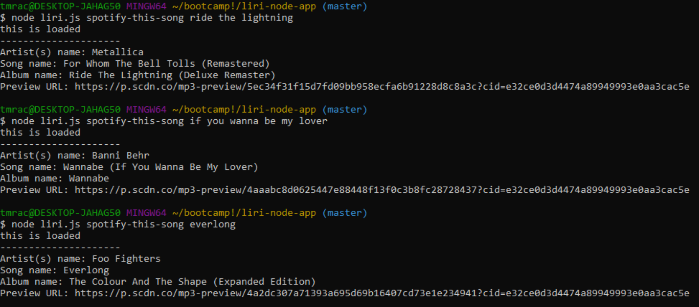

# Liri-Node-App

## What does it do?
 The Liri-Node-App is a Language Interpretation and Recognition Interface. Basically, you can input your favorite song, band, or movie and all sorts of cool data will be logged to your console. 
 * This app utilizes the spotify api to search their massive database to retrieve your favorite song. When you type "spotify-this-song" then the song name, the app will log the Artists name, track name, name of the album the track is in, and a link to preview the track. 
   ```
   // Example:

   node liri.js spotify-this-song over the rainbow

   // node will then log this:
   
   Artist(s) name: Israel Kamakawiwo'ole
   Song name: Over the Rainbow
   Album name: Alone In Iz World
   Preview URL: https://p.scdn.co/mp3-preview/efa050a71295c8fb7e7809f48e67a171aef5704e?cid=e32ce0d3d4474a89949993e0aa3cac5e 
   ```
   
 * This app also utilizes the Band In Town api which allows you to search a band/performer. By typing "concert-this" followed by the band the app will log the name of the venue, the location of that venue, and the time of that event. 

 * Finally, for all the movie guru out there, this app uses the omdb api so search movie info. Type "movie-this" followed by the movie and the app will return the title, release year, IMDB rating, rotten tomatoes rating, the plot, and the actors. 
    
## How is this useful?
 The app helps the user quickly and effecienty find useful data related to their specific search. 

## Conflicts and Technical Approach
 Eventhough what is displayed may seem simple, there is quiet a few complications and difficulties in creating a simple app like this.
   - First of all, setting up the spotify api with the id and secret takes a few steps because of security reasons. Once you have the keys in place then you can begin to require all the modules needed.
   - In the design, we know we want to utilize three different api calls and be able to trigger each one by a specific call. For this step I went with a switch method. I passed the variable "action", which is set as my process argument second index, and each case in this method will call the function for that specific api needed to run. 
   - Now with the functions ready to be called, I began by logging the complete response. From the entire response I was able to use dotnotation to extract the specific data I wanted to showcase. The trick to this was having to use .parse method for the JSON response. Without parsing the data the response treated the data as one long string, so when you declared a specific index, it would only return "{" or "L" or whatever character landed on the requested index.
   - I also made sure to install all the required npm packages. For this app I had to require my keys.js file, node-spotify-api, request, fs, and moment. Moment.js was used very briefyly to convert the time of the event from a default format to a more easy to read format ("mm/dd/yyyy") in the band-in-town api response.
   - The final challenge of this app was to be able to read a text file and have to app interprit the text into a command to run one of the api responces. To conquer this obstacle I used the built in node package "fs". Once I required fs, I was able to read the text file. I did a .split method that created an array and split the two phrases at the comma. I then ran a for loop and called the first index[0] equal to the action argument and the second index[1] equal to my node argument. The node argument is basically the search perameter wheather it be the band name, movie name, or track name.  

## Links
Band In Town Screen Shot
 
Spotify Screen Shot
 
OMDB Screen Shot
 
do-what-it-says Screen Shot
 